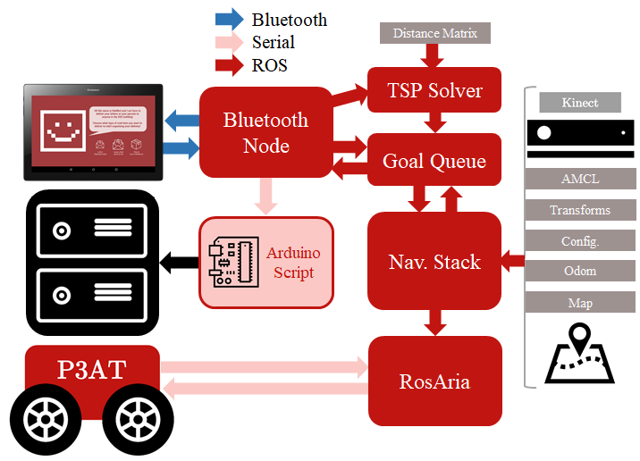

# MailBot
EE4-60: Human Centered Robotics [Imperial College London]. 2018-2019.

## Installation

### Interface - `MailBot/interface`
Android application created for the Lenovo Tab 2 A-10 70F (Android Version:6), on Android Studio (3.1).

### ROS - `MailBot/movement`
The `MailBot/movement/` folder contains the catkin workspace `catkin_ws`.
The system used was Ubuntu 16.04 running ROS1 (Kinetic).
  1. `apt-get` related installs (detailed in : `AnyInstalls.odt`):
     1. sudo apt-get install ros-kinetic-rviz-plugin-tutorials [Teleop plugin for rviz]
     2. sudo apt-get install ros-kinetic-p2os-urdf [Robot model]
     3. sudo apt-get install ros-kinetic-rtabmap-ros [RTAB-MAP]
  2. Other 'git clone'installed ROS packages (incl. commit hash) used:
     1. `depthimage_to_laserscan` [git clone -b indigo-devel --single-branch https://github.com/ros-perception/depthimage_to_laserscan.git] [git checkout f135fbd5f60dc7b]
     2. `iai_kinect2` [git clone -b master --single-branch https://github.com/code-iai/iai_kinect2.git] [git checkout 0e2c5f63134a076606bb7996] **NOTE: Not required for current version, this is the Kinect 2 specific driver**
     3. `openni_camera` [git clone -b indigo-devel --single-branch https://github.com/ros-drivers/openni_camera.git] [git checkout e898a]
     4. `pointcloud_to_laserscan` [git clone -b indigo-devel --single-branch https://github.com/ros-perception/pointcloud_to_laserscan.git] [git checkout ead0804]
     5. `rgbd_launch` [git clone -b indigo-devel --single-branch https://github.com/ros-drivers/rgbd_launch.git] [git checkout 2123238]
     6. `rosaria` [git clone -b master --single-branch https://github.com/amor-ros-pkg/rosaria.git] [git checkout aa8d5f7]
     7. `rosaria_client` [git clone -b master --single-branch https://github.com/pengtang/rosaria_client.git] [git checkout 31bf5c0]
     8. `timed_roslaunch` [git clone -b master --single-branch https://github.com/MoriKen254/timed_roslaunch.git] [git checkout  5283d6f]
  3. `install_iai_kinect2.sh` is for XBOX Kinect 2 required dependencies, this is no longer relevant as the XBOX Kinect 1 is now used.

How to Use:
  1. All scripts located in the `catkin_ws/src/mailbot/scripts/` folder were set to executable using:   `sudo chmod +x <script_name>.py`
  2. `rtabmap_mailbot.launch` should be run beforehand to generate a map using the Kinect camera (and odometry provided by RosAria).
  3. The `mailboot.launch` file starts up the major components of the system:
      1. `boot.launch` : Initialises: RosAria (driver for P3-AT) at specific USB port, includes the URDF model for the P3-AT. Establishes a static transform for the location of the sonar sensors.
      2. `kinectBoot.launch`: Initialises the Kinect 1. Additionally, the bottom of this file intialiases a static transform for the location of the camera.
      3. `nav2.launch`: Initialises RTAB-Map and sensor related transforms
          * The `.db` specified in arg `database_path` is generated beforehand using `rtabmap_mailbot.launch`
      4. `move_base.launch`: Initialises AMCL and
      5. `btApp.launch`: Initialises the ROS side of bluetooth communications
      6. `tspSolver`: Receives delivery locations by bluetooth and figures out the best path based on `weights.csv`.
            * **NOTE: The location of `weights.csv` should be changed in the tspSolver script, variable name: `csvPath`**
            * `weights.csv`: A lower-left triangular matrix that specifies the 'cost' of going to a given location. Each row/column would correspond to a defined room. e.g. (0,0) = ( start room, end room -1 ) time to go from Room 0 to Room 1
      7. `locationQueueMoveBase`: Associates delivery locations to co-ordinates that are sent to the ROS Navigation Stack. Ensures goals are sent at the appropriate time by communicating with the interface.

Quality of Life Scripts:
  1. `teleop.launch` - keyboard based teleoperation.

Incomplete or Deprecated Scripts:
  1. `rplidar.launch`, `laserscan_config.launch` & `view_rplidar.launch`: initialises LIDAR and filters out certain laser data.
  2. `gazeboMai.launch`: Spawns Gazebo model of P3-AT
  3. `rtabMap-fakeOdom.launch`: Uses visual odometry for RTAB-Map

  ### ROS architecture description
  
  - Bluetooth Node - Scripts/`BTApp.py`: Connects to tablet via bluetooth. Receives string of locations to visit and passes these to TSP solver on /deliveryLocations. Listens for /atLocation and notifies tablet. When a delivery is complete it posts to /deliveryComplete, to notify the queue. Sends serial commands to the Arduino to unlock locker latches.
  - Arduino Script - Hardware/latch/`latch.ino`: Loaded to the Arduino. When it receives a value via serial it opens the corresponding locker
  - TSP Solver - Scripts/`tspSolver.py`: Takes a string containing a list of locations e.g. 507 508 510 from topic /deliveryLocations and posts a solved route based on an input cost matrix '`Weights.csv`' to /solvedPaths
  - Goal Queue - Scripts/`locationQueueMoveBase.py`: Takes a list of locations from /solvedPaths and passes the first location as a goal (MoveBaseGoal) to the navigation stack as an action. When it receives a result it will post that location to /atLocation. It then waits for a /deliveryComplete post.
  - Navigation Stack: Consists of many packages, transforms, config files. Takes a map, odom data, kinect sensor info etc. and a goal from Goal Queue and outputs twist messages to Rosaria to control the robot.
  - RosAria: Framework used to interact with the P3AT to provide it with twist messages and such.

## Hardware related  - `MailBot/hardware`
###
(Bill of Materials + Tecnical Drawing / Laser Cutting things)
### Latches
### MOSFETs
### MDF (Schematics)
